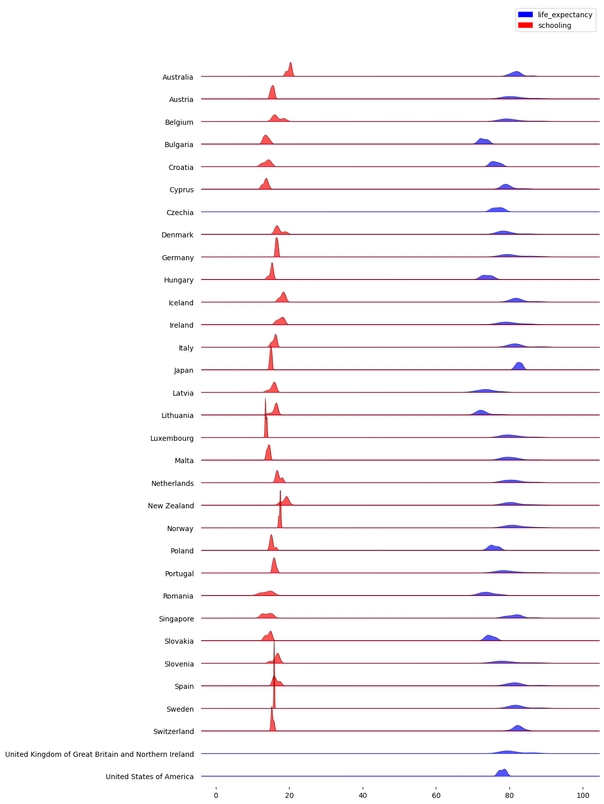

# Statistical Analysis of `Life Expectancy Dataset`

## Developed Countries

### Schooling

In the figure below, one can see the Schooling grade as a function of country's Life Expectancy for developed countries.

### Data Distribution

Below is shown a simplified histogram of the data used in this project for developed countries.

### Correlation

Below is shown correlations between the features presented in the dataset with Life Expectancy, from which one can notice that `income resources` and `schooling` are the most highly correlated features, and ` thinness` from 5-9 years and 1-5 years are the most negatively correlated features.

### Statistical Model

In the figure below is shown the statistical modeling, after performing feature selection in order to reduce the **VIF**, showing an acceptable R2 value on the train data.

### Machine Learning Modeling

Below is shown the Machine Learning Modeling performed in this data by using a **Random Forest Regressor** algorithm, showing that thinness, income resources, and adult mortality are the most important features in order to predict Life Expectancy in developed countries.

### Explainable AI (XAI)

In the Violin Plot below are shown the shap values for the features in terms of impact in the predictions. For instance, one can notice that high values of income resources are related to high values of Life Expectancy and low values of incoming resources are related to low values of Life Expectancy in developed countries. As well, high values of thinness in the range 1-19 years are related to lower values of Life Expectancy, and low values of thinness in the range 1-19 years are related to higher values of Life Expectancy.

## Under-development Countries

### Data distribution

Below is shown a simplified histogram of the data used in this project for countries under-development.

### Pair plots

The next figure shows pairplots of the main features for countries under-development.

### Life Expectancy Correlation

Below are shown correlations between the features presented in the dataset with Life Expectancy, from which one can notice that `income resources` and `schooling` are the most highly correlated features, and ` aids` and `adult mortality` are the most negatively correlated features.

### ML model Feature Importance

Below is shown the Machine Learning Modeling performed in this data by using a **Random Forest Regressor** algorithm, showing that `aids`, `bmi`, and ` thinness from 1-19 years` are the most important features in order to predict Life Expectancy in under-development countries.

### Statistical Modeling Results

In the figure below is shown the statistical modeling, after performing feature selection in order to reduce the **VIF**, showing a very good R2 (0.83) value on the train data.

### Explainable AI (XAI)

In the Violin Plot below are shown the shap values for the features in terms of impact in the predictions. For instance, one can notice that high values of `aids` are related to low values of `Life Expectancy` and low values of `aids` are related to high values of `Life Expectancy` in under-development countries. As well, high values of `alcohol` are related to higher values of `Life Expectancy`, and low values of `alcohol` are related to lower values of Life Expectancy.

# Contributor Covenant Code of Conduct

## Our Pledge

We as members, contributors, and leaders pledge to make participation in our
community a harassment-free experience for everyone, regardless of age, body
size, visible or invisible disability, ethnicity, sex characteristics, gender
identity and expression, level of experience, education, socio-economic status,
nationality, personal appearance, race, caste, color, religion, or sexual
identity and orientation.

We pledge to act and interact in ways that contribute to an open, welcoming,
diverse, inclusive, and healthy community.

## Our Standards

Examples of behavior that contributes to a positive environment for our
community include:

* Demonstrating empathy and kindness toward other contributions that are not aligned with this Code of Conduct, and will communicate reasons for moderation decisions when appropriate.

## Scope

This Code of Conduct applies within all community spaces, and also applies when
an individual, or aggression toward or disparagement of classes of individuals.

**Consequence**: A permanent ban from any sort of public interaction within the
community.

## Attribution

This Code of Conduct is adapted from the [Contributor Covenant][homepage],
version 2.1, available at
[https://www.contributor-covenant.org/version/2/1/code_of_conduct.html][v2.1].

Community Impact Guidelines were inspired by
[Mozilla's code of conduct enforcement ladder][Mozilla CoC].

For answers to common questions about this code of conduct, see the FAQ at
[https://www.contributor-covenant.org/faq][FAQ]. Translations are available at
[https://www.contributor-covenant.org/translations][translations].

[homepage]: https://www.contributor-covenant.org
[v2.1]: https://www.contributor-covenant.org/version/2/1/code_of_conduct.html
[Mozilla CoC]: https://github.com/mozilla/diversity
[FAQ]: https://www.contributor-covenant.org/faq
[translations]: https://www.contributor-covenant.org/translations is officially representing the community in public spaces.
Examples of representing our community include using an official e-mail address,
posting via an official social media account, or acting as an appointed
representative at an online or offline event.

## Enforcement

Instances of abusive, harassing, or otherwise unacceptable behavior may be
reported to the community leaders responsible for enforcement at
[INSERT CONTACT METHOD].
All complaints will be reviewed and investigated promptly and fairly.

All community leaders are obligated to respect the privacy and security of the
reporter of any incident.

## Enforcement Guidelines

Community leaders will follow these Community Impact Guidelines in determining
the consequences for any action they deem in violation of this Code of Conduct:

### 1. Correction

**Community Impact**: Use of inappropriate language or other behavior deemed
unprofessional or unwelcome in the community.

**Consequence**: A private, written warning from community leaders, providing
clarity around the nature of the violation and an explanation of why the
behavior was inappropriate. A public apology may be requested.

### 2. Warning

**Community Impact**: A violation through a single incident or series of
actions.

**Consequence**: A warning with consequences for continued behavior. No
interaction with the people involved, including unsolicited interaction with
those enforcing the Code of Conduct, for a specified period of time. This
includes avoiding interactions in community spaces as well as external channels
like social media. Violating these terms may lead to a temporary or permanent
ban.

### 3. Temporary Ban

**Community Impact**: A serious violation of community standards, including
sustained inappropriate behavior.

**Consequence**: A temporary ban from any sort of interaction or public
communication with the community for a specified period of time. No public or
private interaction with the people involved, including unsolicited interaction
with those enforcing the Code of Conduct, is allowed during this period.
Violating these terms may lead to a permanent ban.

### 4. Permanent Ban

**Community Impact**: Demonstrating a pattern of violation of community
standards, including sustained inappropriate behavior, harassment of an
individual people
* Being respectful of differing opinions, viewpoints, and experiences
* Giving and gracefully accepting constructive feedback
* Accepting responsibility and apologizing to those affected by our mistakes,
  and learning from the experience
* Focusing on what is best not just for us as individuals, but for the overall
  community

Examples of unacceptable behavior include:

* The use of sexualized language or imagery, and sexual attention or advances of
  any kind
* Trolling, insulting or derogatory comments, and personal or political attacks
* Public or private harassment
* Publishing others' private information, such as a physical or email address,
  without their explicit permission
* Other conduct which could reasonably be considered inappropriate in a
  professional setting

## Enforcement Responsibilities

Community leaders are responsible for clarifying and enforcing our standards of
acceptable behavior and will take appropriate and fair corrective action in
response to any behavior that they deem inappropriate, threatening, offensive,
or harmful.

Community leaders have the right and responsibility to remove, edit, or reject
comments, commits, code, wiki edits, issues, and other