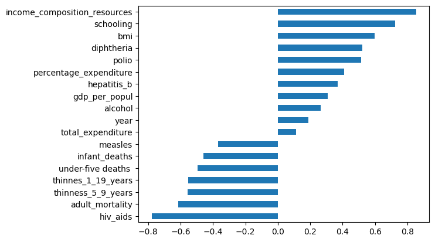

# Statistical Analysis in Life Expectancy Dataset

## Developed Countries

### Schooling

### Data Distribution

### Correlation

### Statistical Model

### Machine Learning Modeling

### Explainable AI (XAI)

## Under-development Countries

### Data distribution

### Pair plots

### Life Expectancy Correlation

### ML model Feature Importance

### Statistical Modeling Results

### Explainable AI (XAI)

